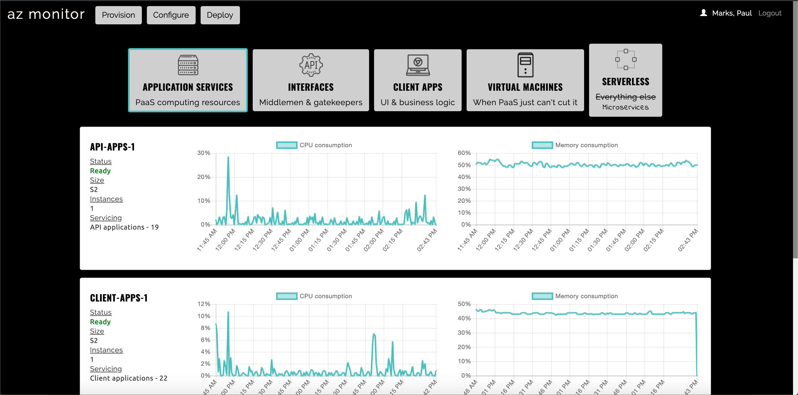

# AZ Monitor

AZ Monitor is a monitoring, provisioning, configuration, and deployment application used by the Department of Innovation & Performance at the City of Pittsburgh.  It, in many ways, is just a simplified and customized version of the Azure portal.  It permits Azure usage and monitoring data to be viewed by employees (read: managers) who do not need direct access to the Azure environment.  Further, it permits developers to spin up APIs, client applications, and virtual machines from templates pre-defined in the [azure-proxy]
(https://github.com/CityofPittsburgh/azure-proxy), thereby insuring a degree of governance and control, while also exposing Azure resources for broader use.

AZ Monitor interfaces with [azure-proxy](https://github.com/CityofPittsburgh/azure-proxy) for all data and functionality.



## A note on boilerplate

The bones of AZ Monitor are shared across all client applications developed by Paul Marks for the City of Pittsburgh.  For more in-depth documentation on the structure,  design choices, authentication flow, and installation procedures for this application, please see the documentation for the [boilerplate](https://github.com/CityofPittsburgh/react-typescript-boilerplate).

This README will focus only on the components of this application that are unique to AZ Monitor.

## Structure
    ...
    app
    ├── src                         
        ├── components              
            |── accessControl           # injectable access control component
            |── filter                  # filter for lists of services                     
            |── manage                  # all components related to the provisioning, config, and deployment of services
            |── metrics                 # reusable line graphs per/ metric type
            |── serviceTypeSelection    # really a nav component...filters services by type selected
            |── view                    # all components related to the viewable service lists and metrics               
        ├── store                   
            |── apiApplications         # all services in the api resource group
            |── appServices             # all services in the app services resource group
            |── clientApps              # all services in the client resource group
            |── serverlessApps          # all services in the lambda resource group        
            |── virtualMachines         # all virtual machines      

## Running Locally

### Prerequisites

* [Node.js](https://nodejs.org) - JS runtime
* .env - See .env.example for all required secrets

### Installation
```
git clone https://github.com/CityofPittsburgh/az-monitor
cd az-monitor
// first, install dependencies for the server
npm install
// then, install dependencies for the client
cd app
npm install
// to run the app locally and bypass auth
npm start
// to bundle the app for deployment
npm run build
// to run the app from the minified build, with auth workflow
cd ..
node server.js
```

## Deployment

Both staging and production services are hosted in Azure.  Application is deployed directly from github, and can be triggered either (a) through the Azure GUI, (b) through the [CLI](https://docs.microsoft.com/en-us/cli/azure/webapp/deployment/source?view=azure-cli-latest#az-webapp-deployment-source-sync), or (c) through the [proxy service](https://github.com/CityofPittsburgh/azure-proxy).

For complete documentation on the azure environment, see [here](https://github.com/CityofPittsburgh/all-things-azure.git).

## License

This project is licensed under the MIT License - see the [LICENSE.md](LICENSE.md) file for details